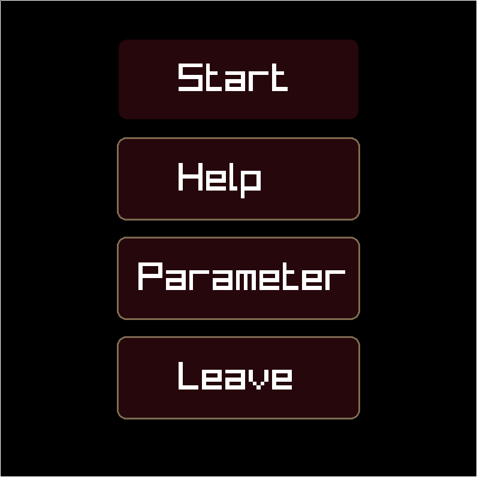
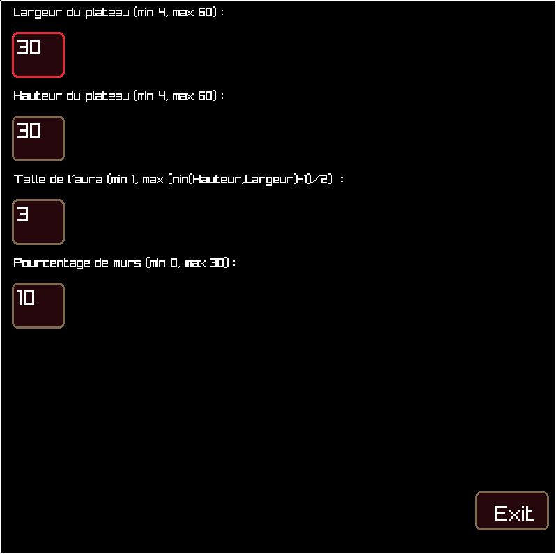
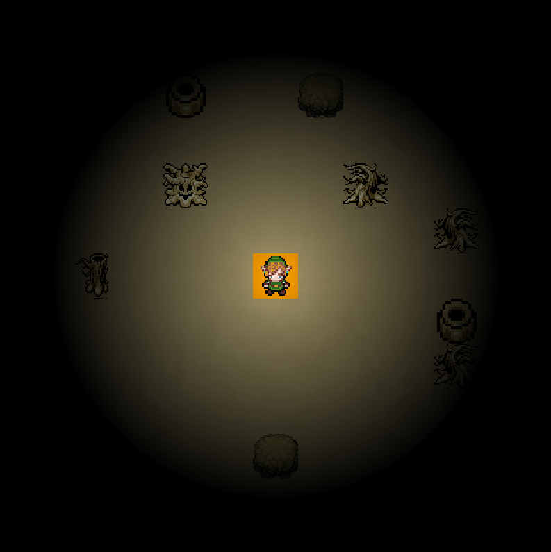

# NetWorld - Game Engine for IAs competition 

## Présentation

NetWorld se veut devenir un moteur de jeux basé sur la librairie multi-plateforme RayLib, respectant le principe [KISS](https://fr.wikipedia.org/wiki/Principe_KISS)  (Keep It Stupid Simple) 
La particularité du projet est de modéliser le monde comme un réseau de positions clés sur lesquelles peuvent se déplacer les entités en interaction.

Afin de témoigner des capacités du moteur de jeu, une jeu-démo, "Slenderman" a été développé. Le but du jeu est de ramasser 7 pages dispersé sur un terrain tout en évitant le Slenderman et son aura.

Pour comprendre les differents modules, le fonctionnement du moteur de jeu, nous vous invitons très fortement à vous référer à la documentation Doxygen présente dans "./doc/html/index.html".

Réaliser un make vous génère un ensemble d'exécutables relatif au NetWorld et au jeu-démo :

### nw-slenderman

Cet éxécutable est celui du jeu créé pour témoigner des capacités du NetWorld.

Le joueur démarre dans un écran titre qui lui propose de démarrer le jeu, accéder à une page d'aide, changer les paramètres ou quitter.

Les déplacements dans les menus se font uniquement avec les flèches directionelles.



La page d'aide décrit les commandes et le syonpsis. Le but du jeu est de récupérer les 7 pages dispersés dans la carte tout en évitant le slenderman et son aura.

La page de paramètre permet de configurer la partie



Les paramètres sont les suivants :

- La largeur du plateau (entre 4 et 60)
- La longeur du plateau (entre 4 et 60)
- Le rayon de l'aura (entre 1 et le minimum entre la largeur et la hauteur, moins un, le tout divisé par 2)
- Le pourcentage de mur dans le map (entre 0 et 30%)

Les paramètres doivent être rentrés avec les numeros sans utiliser le numpad.

Le terrain est généré aléatoirement selon ces paramètres.

Lors de la partie, il est possible de zoomer avec la molette.



Il se peut que selon ces paramètres, l'IA aie du mal à fonctionner et décide de ne plus bouger après un moment et rendant la fermeture propre du jeu impossible, voire rendant le lancement du jeu impossible. Cette possibilité, très rare, est cependant plus fréquente lorsque :

- Les proportions du terrain sont plus grande
- La proportion de murs dans le terrain augmente

Il manque a la fin un écran indiquant qui à gagné malheureusement, vous êtes redirigé directement sur l'écran titre après avoir gagné ou perdu la partie.

### nw-test*

Trois exécutables de tests sont générés. Ces exécutables servent lors du développement à s'assurer que les fonctions marchent bien et qu'aucune fuite de mémoire n'ait lieu grâce à valgrind. Elles concernent 3 points du moteur de jeu :

- L'IA (nw-testIA) | Ce test peut prendre un peu de temps lors de l'éxécution du à des sleeps.
- Le NetWorld (nw-testNetWorld)
- Les fonctions utilitaires (nw-testUtils)

ATTENTION : Ces tests sont des tests unitaires réalisé avec <assert.h>. Ce n'est pas car ils affichent rien qu'ils ne marchent pas. Au contraire, cela est un signe positif.
Si un test plante, il affichera dans le terminal une ligne d'erreur :

```
nw-testUtils: tests/testUtils.c:55: testQueueSimple: Assertion `ejected == ints + 2' failed.
```

Ainsi, pour comprendre ce qui est testé et vérifié plus en détail, nous vous invitons à lire les fichiers tests regroupés dans "./src/tests".

## Compiler NetWorld

```
make config
make
```

## Organisation du répertoire

Répertoire:

- *doc* : la documentation du projet.
- *.git* : répertoire de gestion de version propre à git.
- *src* : le code source du projet.
- *resources* : les differentes ressources utilisés dans le jeu (images, son...)
- *screenshots* : les screenshots utilisés dans le README.md

Fichier à la racine:

- *.gitignore* : fichier de configuration git listant les ressources à ne pas versionner.
- *config* : Fichier de configuration pour le make (cf. *src/Makefile*).
- *config.default* : Fichier *config* utilisé à défaut (cf. *Makefile*).
- *Makefile* : Instruction de construction du projet pour *make*. Génère *config* et fait appel à *src/Makefile*.
- *projet-outline.md* : Un descriptif des composants logiciel réalisé et prévu.
- *nw-xxxx* : Les exécutables.
- *README.md* : Moi!
